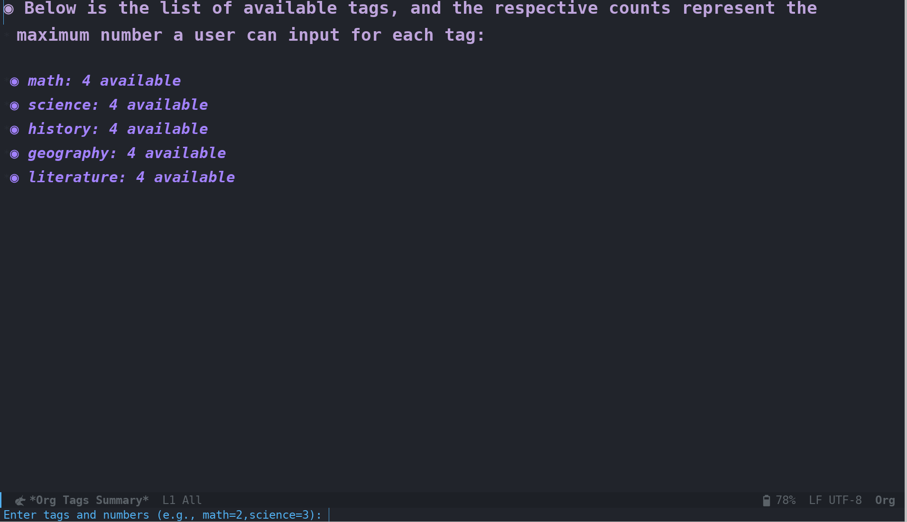

# MCQ Balance Engine

The **MCQ Balance Engine** is an Emacs Lisp tool designed to facilitate the creation of randomized, balanced, and non-repeating sets of multiple-choice questions (MCQs) within Org-mode files. It supports tag-based filtering, persistent uniqueness across sessions, and seamless export of questions and answers for exams, quizzes, or productivity templates.

# Demo (Updated versions could be different)

[](https://youtu.be/dl1TpdEbq7Q)

# Features

- 🌀 **Fisher–Yates shuffle**: Fairly randomizes selection of Org subtrees.
- 🔖 **Tag-based filtering**: Selects only top-level parent or leaf nodes with tags.
- 📊 **Tag summary buffer**: Shows a real-time count of how many items are available per tag.
- 🎯 **User-defined tag input**: Choose how many questions per tag to include.
- 🧠 **Persistent uniqueness**: Guarantees previously seen combinations won't repeat across sessions.
- 🆔 **Random 3-digit exam code**: Each combo is given a unique ID stored on disk.
- 📤 **Export cleaned buffer**: Removes metadata, renumbers questions, and optionally shows tags.
- 📥 **Extract correct answers**: Outputs answers into a CSV file from Org `:Correct:` properties.
- 🔍 **Check missing correct answers**: Identify questions missing the `:Correct:` property in your Org-mode files. It displays clickable links to those questions, making it easy to fix them.


# Installation

To use the MCQ Balance Engine, simply download the following files:

1. `mcq-persistent-org-combo-shuffler.el`
2. `mcq-extract-correct-answers.el`
3. `mcq-export-cleaned-questions.el`
4. `mcq-check-missing-correct-answers.el`

Place them in your Emacs `load-path` directory and load them into your Emacs environment.

```emacs-lisp
(load-file "/path/to/mcq-persistent-org-combo-shuffler.el")
(load-file "/path/to/mcq-extract-correct-answers.el")
(load-file "/path/to/mcq-export-cleaned-questions.el")
(load-file "/path/to/mcq-check-missing-correct-answers.el")
```

Alternatively, you can copy the contents of these files into your Emacs configuration file.

For those who are using `use-package`, insert the similar snippet in your `init.el` or `config.org`:
```emacs-lisp
(use-package mcq-balance-engine
  :load-path "~/.emacs.d/github/mcq-balance-engine"
  :commands (mcq-persistent-org-combo-shuffler
             mcq-extract-correct-answers
             mcq-export-cleaned-questions
             mcq-check-missing-correct-answers)
  :init
  ;; Custom settings before loading
  (setq mcq-persistent-org-combo-shuffler-max-attempts 500)
  :config
  ;; Org-mode keybindings
  (with-eval-after-load 'org
    (define-key org-mode-map (kbd "C-c m s") #'mcq-persistent-org-combo-shuffler)
    (define-key org-mode-map (kbd "C-c m e") #'mcq-extract-correct-answers)
    (define-key org-mode-map (kbd "C-c m x") #'mcq-export-cleaned-questions)
    (define-key org-mode-map (kbd "C-c m c") #'mcq-check-missing-correct-answers)))
```

# Usage

## Persistent Org Combo Shuffler

To start shuffling and selecting unique combinations of Org-mode headings by tags:

1. Open your Org-mode file in Emacs.
2. Run the command: `M-x mcq-persistent-org-combo-shuffler`
3. The engine will display a summary of available tags and their counts.
4. Enter your tag specifications (e.g., `math=2,science=3`).
5. The engine will generate a unique combination of headings, ensuring that no combination repeats.

## Extract Correct Answers

To extract the correct answers and save them as a CSV:

1. Open your Org-mode file containing questions and answers.
2. Run the command: `M-x mcq-extract-correct-answers`
3. You will be prompted to enter a file path where the answers will be saved.
4. The answers will be extracted and saved in a CSV format with the structure: `Question, Answer`.

## Export Cleaned Questions

1. From the shuffled buffer, run the command: `M-x mcq-export-cleaned-questions`
2. Renumbers all questions sequentially (`Question 1`, `Question 2`, etc. or `Câu 1`, `Câu 2`, ... if in Vietnamese).
3. Removes all `:PROPERTIES:` drawers.
4. Optionally includes tags inline.
5. Preserves `Exam code: 3-digit number` heading at the top.

## Check Missing Correct Answers

1. Open your Org-mode file.
2. Run `M-x mcq-check-missing-correct-answers`.
3. A buffer will open showing links to questions missing the `:Correct:` value.

# Customization

The **MCQ Balance Engine** stores previously used combinations and IDs to ensure that no combination is repeated.

You can configure the maximum number of attempts to generate a unique combination by modifying the `max-attempts` variable in the code.

# File Structure

- `mcq-persistent-org-combo-shuffler.el`: Contains functions for shuffling and displaying MCQ combinations.
- `mcq-extract-correct-answers.el`: Extracts correct answers marked by `:Correct:` and saves them to a CSV.
- `mcq-export-cleaned-questions.el`: Exports shuffled MCQ questions into a clean Org buffer.
- `mcq-check-missing-correct-answers.el`: Scans MCQ entries and detects if any questions are missing a correct answer.
- `-unique-combinations.el`: A file storing previously generated combinations for the associated Org file.
- `.used-ids.el`: A file storing the used 3-digit IDs for the associated Org file.

# Notes

- Combinations are normalized by heading content for accurate comparison.

- Intermediate child nodes (with children) are excluded from tag summary.

# Tested Environment

- Debian 12 / WSL2: Ubuntu 22.04 LTS

- Emacs: 30.1

- Orgmode: 9.7.11

# Disclaimer

This program is provided "as is", without any warranty of any kind, express or implied, including but not limited to the warranties of merchantability, fitness for a particular purpose, or non-infringement. In no event shall the authors or copyright holders be liable for any claim, damages, or other liability, whether in an action of contract, tort, or otherwise, arising from, out of, or in connection with the program or the use or other dealings in the code.

Use this code at your own risk. It is your responsibility to ensure that the generated combinations and associated data are accurate and appropriate for your use case.

